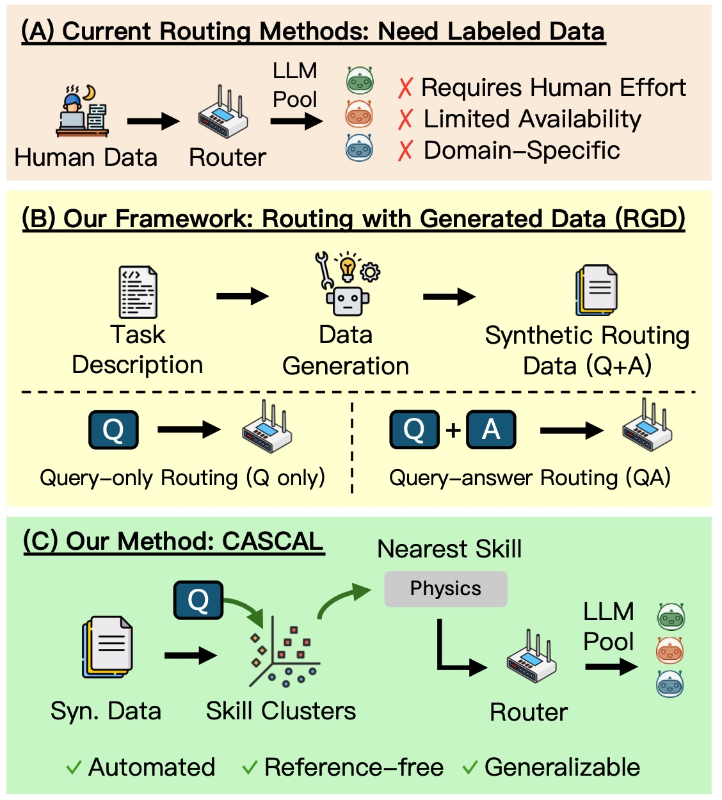
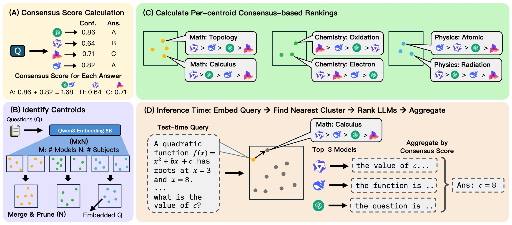

# Routing with Generated Data: Annotation-Free LLM Skill Estimation and Expert Selection
[](http://arxiv.org/abs/2601.09692)
[](https://opensource.org/licenses/MIT)

[Tianyi Niu](https://tianyiniu.github.io/)<sup>1</sup> | [Justin Chih-Yao Chen](https://dinobby.github.io/)<sup>1</sup> | [Genta Indra Winata](https://gentawinata.com/)<sup>2</sup> | [Shi-Xiong (Austin) Zhang](https://www.linkedin.com/in/sx-zhang/)<sup>2</sup> | [Supriyo Chakraborty](https://www.linkedin.com/in/supriyo-chakraborty-9040bb140/)<sup>2</sup> | [Sambit Sahu](https://www.linkedin.com/in/sambitsahu/)<sup>2</sup> | [Yue Zhang](https://zhangyuejoslin.github.io/)<sup>1</sup> | [Elias Stengel-Eskin](https://esteng.github.io)<sup>3</sup> | [Mohit Bansal](https://www.cs.unc.edu/~mbansal/)<sup>1</sup>

<sup>1</sup>UNC Chapel Hill <br>
<sup>2</sup>Capital One<br>
<sup>3</sup>The University of Texas at Austin<br>

# Table of Contents
- [Abstract](#abstract)
- [CASCAL Router](#cascal-router)
- [Setup](#setup)
  - [Model Nicknames](#model-nicknames)
  - [API Keys](#api-keys)
- [Experiments](#experiments)
  - [Dataset Formatting](#dataset-formatting)
  - [Data Preprocessing](#data-preprocessing)
  - [Running CASCAL](#running-cascal)
- [Quick Start with Pre-Generated Model Responses](#quick-start-with-pre-generated-outputs)
- [Citation](#citation)

# Abstract



---
Large Language Model (LLM) routers dynamically select optimal models for given inputs. Existing approaches typically assume access to ground-truth labeled data, which is often unavailable in practice, especially when user request distributions are heterogeneous and unknown. We introduce Routing with Generated Data (RGD), a challenging setting in which routers are trained exclusively on generated queries and answers produced from high-level task descriptions by generator LLMs. We evaluate query-answer routers (using both queries and labels) and query-only routers across four diverse benchmarks and 12 models, finding that query-answer routers degrade faster than query-only routers as generator quality decreases. Our analysis reveals two crucial characteristics of effective generators: they must accurately respond to their own questions, and their questions must produce sufficient performance differentiation among the model pool. We then show how filtering for these characteristics can improve the quality of generated data. We further propose CASCAL, a novel query-only router that estimates model correctness through consensus voting and identifies model-specific skill niches via hierarchical clustering. CASCAL is substantially more robust to generator quality, outperforming the best query-answer router by 4.6% absolute accuracy when trained on weak generator data. 

# CASCAL Router



---

Overview of CASCAL. (A) Consensus Scoring: we extract model responses for each query and compute confidence-weighted consensus scores. (B) Centroid Identification: For each model and subject, we cluster queries where the model demonstrates proficiency to obtain skill centroids, then we merge similar centroids across models. (C) Cluster Ranking: we assign queries to their nearest centroid and rank models within each cluster by average consensus score. (D) Inference: we route test queries to the nearest subject and centroid, select the top-3 (or top-1) ranked models, and aggregate responses via consensus voting.

# Setup

## Model Nicknames
The codebase makes frequent use of the following model nicknames:

| Nickname      | Model Name                                       |
|---------------|--------------------------------------------------|
| OSS120        | openai/gpt-oss-120b                              |
| Qwen3-32      | Qwen/Qwen3-32B                                   |
| GLM4-32       | zai-org/GLM-4-32B-0414                           |
| Llama70       | meta-llama/Llama-3.3-70B-Instruct                |
| Gemma3-27     | google/gemma-3-27b-it                            |
| Exaone4-32    | LGAI-EXAONE/EXAONE-4.0-32B                       |
| Gemma         | google/gemma-2-9b-it                             |
| Exaone        | LGAI-EXAONE/EXAONE-3.5-7.8B-Instruct             |
| GLM4          | zai-org/glm-4-9b-chat                            |
| Qwen3-8       | Qwen/Qwen3-8B                                    |
| DpskMath      | deepseek-ai/deepseek-math-7b-instruct            |
| Yi15          | 01-ai/Yi-1.5-9B-Chat-16K                         |

## API Keys

To run experiments with proprietary models, create a `.env` file in the project root with the following:

```
GEMINI_API_KEY=your_gemini_api_key_here
```

## Installation

```bash
# Clone repository
git clone https://github.com/tianyiniu/RoutingGenData.git
cd RoutingGenData

# Install dependencies
pip install -r requirements.txt
```

Required packages include: `vllm`, `transformers`, `torch`, `datasets`, `google-genai`, `scikit-learn`, `openai`, `math-verify`.

# Experiments

## Dataset Formatting

The codebase supports four major benchmarks. Each dataset should be formatted as a JSON list of question dictionaries with the following structure:

```json
{
  "question_id": 0,
  "category": "subject_name",
  "question": "Question text here",
  "options": ["Option A", "Option B", "Option C", "Option D"],
  "answer": "A"
}
```

### Supported Datasets

| Dataset | Script | Source |
|---------|--------|--------|
| MMLU-Pro | `code/prepare_data/MMLU_Pro_format.py` | [TIGER-Lab/MMLU-Pro](https://huggingface.co/datasets/TIGER-Lab/MMLU-Pro) |
| SuperGPQA | `code/prepare_data/SuperGPQA_format.py` | [m-a-p/SuperGPQA](https://huggingface.co/datasets/m-a-p/SuperGPQA) |
| MedMCQA | `code/prepare_data/MedMCQA_format.py` | [openlifescienceai/medmcqa](https://huggingface.co/datasets/openlifescienceai/medmcqa) |
| BBEH | `code/prepare_data/BigBench_ExtraHard_format.py` | [google-deepmind/bbeh](https://github.com/google-deepmind/bbeh) |

To download and format a dataset:

```bash
python -m code.prepare_data.MMLU_Pro_format
# Output: ./Data/MMLU_Pro/all.json
```

## Data Preprocessing

### Step 1: Train-Test Split

```bash
python -m code.prepare_data.train_test_split \
  --task MMLU_Pro
# Output: ./Data/MMLU_Pro/train.json, ./Data/MMLU_Pro/test.json
```

### Step 2: Generate RGD Datasets

#### Option A: Using vLLM (local generators)

```bash
python -m code.RGD.local_gen \
  --model_nickname Qwen3-32 \
  --task MMLU_Pro \
  --split train \
  --cuda-devices 0,1
```

#### Option B: Using Gemini API

```bash
python -m code.RGD.gemini_gen \
  --task MMLU_Pro \
  --split train
# Output: `./Model_Responses/{TASK}-{SPLIT}/{model_nickname}.json`
```

### Step 3: Generate Model Responses


```bash
python -m code.preprocess.agent_responses \
  --model_nickname Llama70 \
  --task MMLU_Pro \
  --split train \
  --cuda-devices 0,1
```

### Step 4: Compute Consensus Scores

```bash
python -m code.preprocess.get_consensus_score \
  --task MMLU_Pro \
  --split train \
  --models large
# Output: Updated model response files with consensus_score and z_score fields
```

### Step 5: Generate Question Embeddings

```bash
python -m code.preprocess.get_embeddings \
  --task MMLU_Pro \
  --split train \
  --cuda-devices 7
# Output: ./artifacts/MMLU_Pro_only_question_embeddings_early.pt
```

## Running CASCAL

### Step 1: Train Router

```bash
python -m code.CASCAL.train \
  --task MMLU_Pro \
  --split train \
  --models large \
  --merge-threshold 0.15 \
  --min-consensus 0.5
# Output: ./artifacts/MMLU_Pro/{centroids_*, rankings_*, assigned_*, subject_representatives.json}
```

### Step 2: Run Inference

```bash
python -m code.CASCAL.infer \
  --train-task MMLU_Pro \
  --test-task MMLU_Pro \
  --split test \
  --models large 
# Output: ./artifacts/MMLU_Pro_agent_selections.json
```

### Step 3: Evaluate Rankings

```bash
python -m code.CASCAL.rankings \
  --task MMLU_Pro \
  --split test \
  --models large 
# Output: Selection accuracy metrics and scaling statistics
```

# Quick Start with Pre-Generated Outputs

If you have pre-computed model responses and embeddings, you can directly train and evaluate the router:

```bash
# Assuming you have:
# - ./Data/MMLU_Pro/train.json (formatted questions)
# - ./Model_Responses/MMLU_Pro-train/*.json (model responses with consensus scores)
# - ./Data/MMLU_Pro/test.json (formatted questions)
# - ./Model_Responses/MMLU_Pro-test/*.json (model responses with consensus scores)
# - ./artifacts/MMLU_Pro_only_question_embeddings_early.pt (embeddings)

# Train router
python -m code.CASCAL.train --task MMLU_Pro --split train --models large

# Run inference on test set
python -m code.CASCAL.infer --train-task MMLU_Pro --test-task MMLU_Pro --split test --models large

# Evaluate
python -m code.CASCAL.rankings --task MMLU_Pro --split test --models large
```

# Citation

If you find our project useful in your research, please cite the following paper:

```bibtex
@misc{niu2026routinggenerateddataannotationfree,
    title={Routing with Generated Data: Annotation-Free LLM Skill Estimation and Expert Selection}, 
    author={Tianyi Niu and Justin Chih-Yao Chen and Genta Indra Winata and Shi-Xiong Zhang and Supriyo Chakraborty and Sambit Sahu and Yue Zhang and Elias Stengel-Eskin and Mohit Bansal},
    year={2026},
    eprint={2601.09692},
    archivePrefix={arXiv},
    primaryClass={cs.CL},
    url={https://arxiv.org/abs/2601.09692}, 
}
```